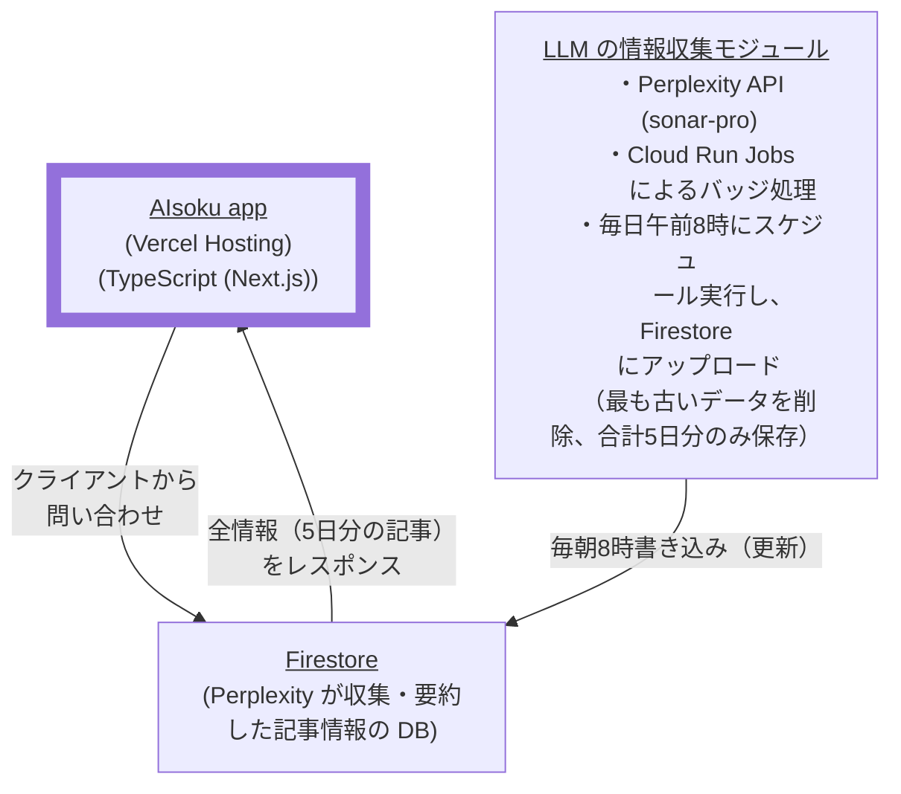

# AIsoku とは？

**進歩が速すぎるAIに関する情報のキャッチアップを、AIを用いて簡単に行う**
ことを目的としたwebアプリとなります。  
毎日午前8時に「AIに関するニュース」と「AIに関する技術記事」の2種類の記事から、LLMが代表的な情報を収集し要約したうえで、その情報を表示します。

デプロイ先：https://aisoku.vercel.app/  
LLMによる情報収集機能 (Host→ Cloud run)：https://github.com/hakuhami/AIsoku-retrieval

## システム構成

## 技術スタック

- **フロントエンド**: Next.js
- **LLM**: Perplexity (sonor-pro)
- **情報更新のバッジ処理**: Cloud run job
- **データベース**: Firestore
- **デプロイ**: Vercel